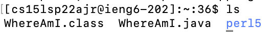
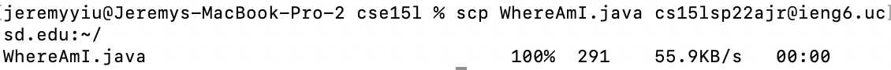

# Week 2 Lab Report (April 8th, 2022)
## Overview
> This is going to be a tutorial for incoming 15L students and my future self to log into course specific accounts like `ieng6`. 

**Steps:**
1) Installing VScode
2) Remotely Connecting
3) Trying Some Commands
4) Moving Files with scp
5) Setting an SSH Key
6) Optimizing Remote Running


## Installing VSCode
Install Visual Studio Code through the link below, and follow the instructed steps to install.

[Windows x64](https://code.visualstudio.com/docs/?dv=win)       [MacOS](https://code.visualstudio.com/docs/?dv=osx)       [Linux (.deb)](https://code.visualstudio.com/docs/?dv=linux64_deb)       [Linux (.rpm)](https://code.visualstudio.com/docs/?dv=linux64_rpm) 

For other options, check Visual Studio Code's [Official Website](https://visualstudio.microsoft.com/downloads/).

Once you finish installing, open the application. It should look like this. 


## Remotely Connecting
Open a new terminal on VS Code using ctrl+shift+\` (Or use the built-in terminal/command prompt/powershell applications on your computer), and input the command below. 

`ssh  <username>` (With the \<username\> replaced with your username.)

Once you press enter, the terminal would prompt you for a password, to which you would input your account's password. 

The password would not show up on terminal as you are inputting it for confidentiality purposes, but don't worry you are typing. 

The terminal should response with something similar to this. 


If you see this screen, then congratulations, you have accessed the course account. 

## Trying Some Commands
Now that you are on the UNIX system in your course account, you can try out some of the UNIX specific commands!
Some commands that are available include:

* cd ~
* cd
* ls -lat
* ls -a
* ls <directory\>
* cp <directory\>
* cat <directory\>

Try them out to see what they do!

To use them, simply type them into the terminal. Example: 


## Moving Files with scp
Now, we will learn how to move files from your local device to the course account. 

To do so, first you will need to navigate your terminal to the file you wish to transfer. (Don't forget to use `logout` to logout of the course account before doing so.)

You can navigate to the file by using the `cd` command we learned above. 

Once the terminal is at the directory the file is contained in, simply use the command below to begin transfer. 

`scp <file-name> <account-name>:<directory>`
```
For example, if I wanted to move the file "WhereAmI.java" on my computer to my course account cs15lsp22ajr@ieng6.ucsd.edu onto the account's default location, I would input: 

scp WhereAmI.java cs15lsp22ajr@ieng6.ucsd.edu:~/
```
Once the terminal returns the screen below, you have completed the transfer. Go check out the file by logging back in through ssh!



## Setting an SSH Key
After having to log in and out of ssh, aren't you tired of having to type your password over and over again?

