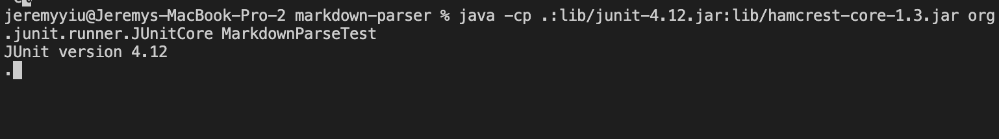

# Week 4 Lab Report (April 22th, 2022)
## Overview
> This is going to be a bug report for the program MarkdownParse that records three bugs and their fixes. 

**Compoents**
1) Bug #1: Infinite Loop

2) Bug #2: Incorrect Output

3) Bug #3: Incorrect Tester

## Bug #1: Infinite Loop
The file that caused the bug: [File](https://github.com/jeyiu/markdown-parser/blob/main/test-file-4.md)

The Symptom of the Bug: 

Changes that fixed the bug: 

Before the fix, the program would return to index -1 and restart the search if it couldn't find any bracket/parenthesis, and continue to loop. 

The fix for this bug was through adding a line that breaks out of the program whenever it couldn't find any more bracket/parenthesis. 

## Bug #2: Incorrect Output
The file that caused the bug: [File](https://github.com/jeyiu/markdown-parser/blob/main/test-file5.md)

The Symptom of the Bug: 

Changes that fixed the bug: 

Before the fix, the program would return `page.com` as one of the links even thought here is something between the end bracket and the open parenthesis. This shouldn't happen because in the syntax of markdown, that doesn't form a hypoerlink.  

The fix for this bug was through adding a line that tests if the space between `closeBracket` and `openParen` is 1. It would only add the link into the result if that is the case. 

## Bug #3: Incorrect Tester
The file that caused the bug: [File](https://github.com/jeyiu/markdown-parser/blob/main/MarkdownParseTest.java)

The Symptom of the Bug: 

Changes that fixed the bug: 

Before the fix, the program would return no output despite the test file containing two hyperlink. This is because the tester for that test file is written incorrectly and it did not find the file it was supposed to test. 

The fix for this bug was through adding the correct lines that looks for the content of the test file intead of only giving the name of the test file to the program. 