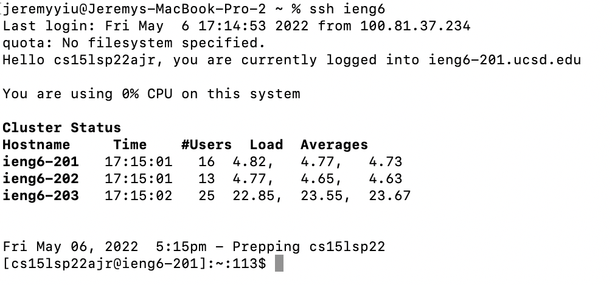
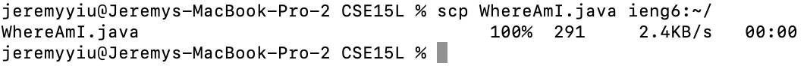
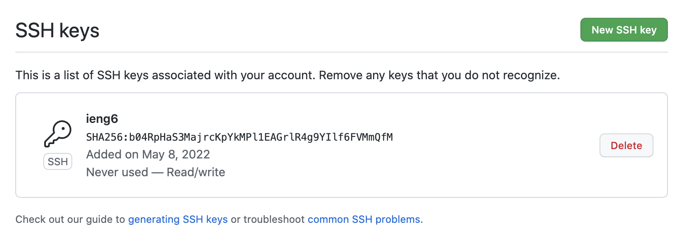
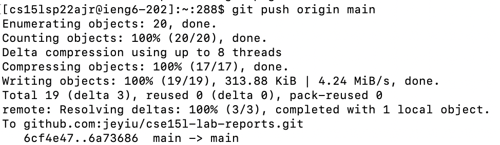
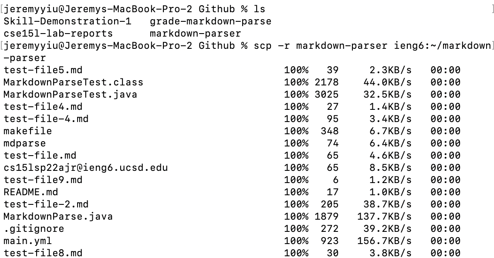
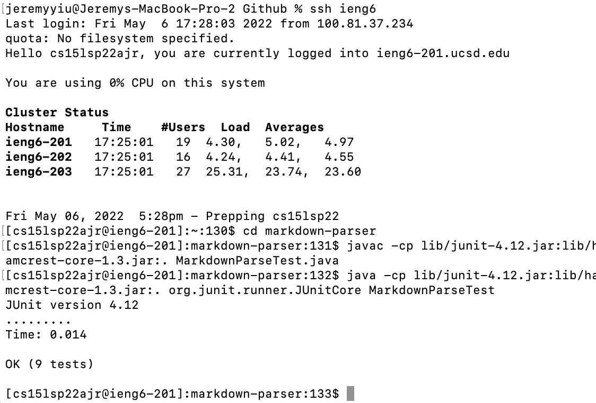
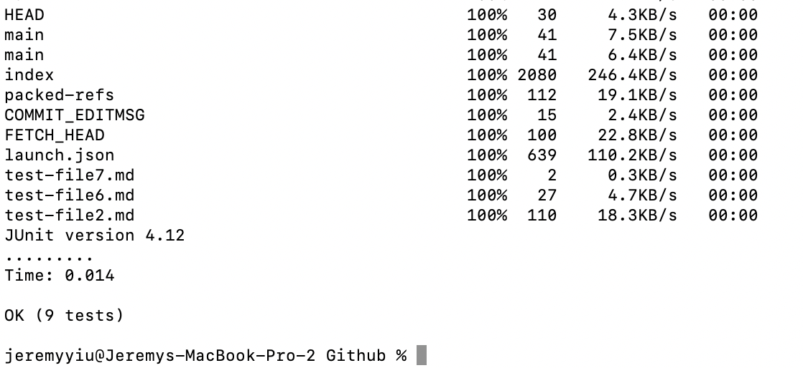

# Week 6 Lab Report (May 6th, 2022)
## Overview
> This report is going to contain the documentation for the completion of 3 tasks assigned in the Lab Report 3 assignment.  

**Compoents**
1) Streamlining SSH

2) Setup Github Access on Course Specific Account

3) Copy Directories

## Streamlining SSH
Using TextEdit, a very great tool provided by Apple that is defaultly installed on your Mac device, I created a new file titled "config" with the content below. 
```
Host ieng6
    HostName ieng6.ucsd.edu
    User cs15lsp22ajr
```
This stores the login information for my account within SSH config so that whenever I want to login to SSH using my course specific account, I would only need to type `ssh ieng6`. 

### SSH Login Attempt


### SCP Transfer Attempt


## Setup Github Access

By using `ssh key-gen`, we are able to generate the ssh key used to grant the remote account acccess to Github. 

By pasting the contents of id_rsa.pub generated from the command within the `/.ssh` directory into Github, we would be able to set up Github access. 

Public Key (on Github): 


Next we need to send the private key to the remote account using the `scp` command. 

Private Key (on course account):


Lastly, after pulling a git repository, we would have to use the command 
```
git remote set-url origin <Repository SSH URl>
```
to make the program remember the pathway to the main repository. Then, we could use remote git to commit/push/pull repositories. 

Success Git Push Example: 



Commit Link: [Link](https://github.com/jeyiu/cse15l-lab-reports/commit/ab0a8ded83093227233f66934701b8bb31884cd5)


## Copy Directories
To copy an entire directory at once using SCP, you simply have to add -r (for recursive) onto the command. 

### Copy Directory Example
> This only contains the top part of the result as there are a lot of files to transfer. 



### Running Tests Remotely


### Running Both at Once
By running: 
```
scp -r markdown-parser ieng6:~/markdown-parser;ssh ieng6 "cd markdown-parser;/software/CSE/oracle-java-17/jdk-17.0.1/bin/javac -cp lib/junit-4.12.jar:lib/hamcrest-core-1.3.jar:. MarkdownParseTest.java;/software/CSE/oracle-java-17/jdk-17.0.1/bin/java -cp lib/junit-4.12.jar:lib/hamcrest-core-1.3.jar:. org.junit.runner.JUnitCore MarkdownParseTest"
```
we get the result: 
