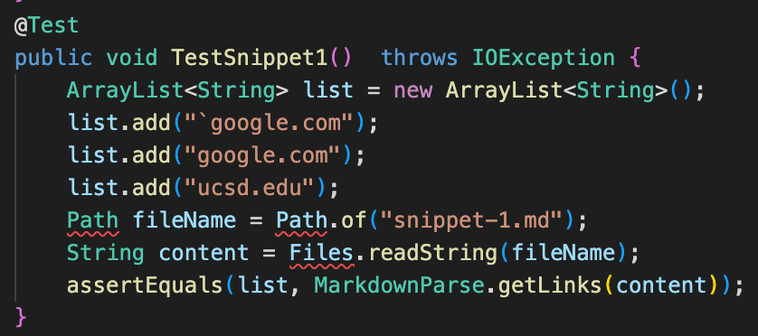

# Week 8 Lab Report (May 21th, 2022)
## Overview
> This report is going to contain the documentation for the completion of testing based on the requirements of Lab Report 4. 

**Compoents**
1) Repository Links

2) Personal Repository Tests
    
    * Test 1
    * Test 2
    * Test 3

3) Given Repository Tests

    * Test 1
    * Test 2
    * Test 3

4) Report Questions

## Used Repositories
Personal repository used: [Link](https://github.com/jeyiu/markdown-parser)

Given repository used: [Link](https://github.com/JasonMorris1/markdown-parser)

<br>

## Personal Repository Tests
**Personal Repository Test 1**

Expected Output: ```["`google.com", "google.com", "ucsd.edu"]```

Test: 


Output: 


Since it outputted an AssertionError, we can tell that the test has failed. It was not supposed to retrieve url.com, yet it did, and it wasn't able to retrieve ucsd.edu. 

**Personal Repository Test 2**

Expected Output: ```["a.com", "a.com(())", "example.com"]```

Test: 


Output: 


Since it outputted an AssertionError, we can tell that the test has failed. It was unable to retrieve a.com(()) nor example.com. Hence, it has failed the test. 

**Personal Repository Test 3**

Expected Output: ```["https://sites.google.com/eng.ucsd.edu/cse-15l-spring-2022/schedule"]```

Test: 


Output: 


Since it outputted an AssertionError, we can tell that the test has failed. It obtained links that were not written in markdown syntax, such as twitter.com. In addition, it also included the `\n` that wasn't supposed to be in the output. 

<br>

## Given Repository Tests
**Given Repository Test 1**

Expected Output: ```["`google.com", "google.com", "ucsd.edu"]```

Test: 


Output: 


Since it outputted an AssertionError, we can tell that the test has failed. It was unable to obtain any of the links within the file. 

**Given Repository Test 2**

Expected Output: ```["a.com", "a.com(())", "example.com"]```

Test: 


Output: 


Since it outputted an AssertionError, we can tell that the test has failed. It was unable to obtain any of the links within the file. 

**Given Repository Test 3**

Expected Output: ```["https://sites.google.com/eng.ucsd.edu/cse-15l-spring-2022/schedule"]```

Test: 


Output: 


Since it outputted an AssertionError, we can tell that the test has failed. It obtained links that were not written in markdown syntax, such as twitter.com. 

<br>

## Report Questions
1) Do you think there is a small (<10 lines) code change that will make your program work for snippet 1 and all related cases that use inline code with backticks? If yes, describe the code change. If not, describe why it would be a more involved change.

It is going to be a more involved process if I wanted to fix the program to correctly read snippet 1 considering I will have to teach it to read the ` mark, which disrupts the string syntax in markdown language. 

2) Do you think there is a small (<10 lines) code change that will make your program work for snippet 2 and all related cases that nest parentheses, brackets, and escaped brackets? If yes, describe the code change. If not, describe why it would be a more involved change.

I think the second snippet could actually be fixed in a small change. It would really hit the upper limit of what is considered a "small" change, but if a while loop is used to loop the search until the bracket/parenthesis closed, (meaning instead of skipping until the end of the bracket, search within to see if there is a new bracket) it would be able to remove the incorrect answers. 

3) Do you think there is a small (<10 lines) code change that will make your program work for snippet 3 and all related cases that have newlines in brackets and parentheses? If yes, describe the code change. If not, describe why it would be a more involved change.

I think this could be fixed in a relatively short edit. I just need to add a test case before adding the result to the return list that checks if the title text contains `\n`, and also `trim()` the result before adding it. 