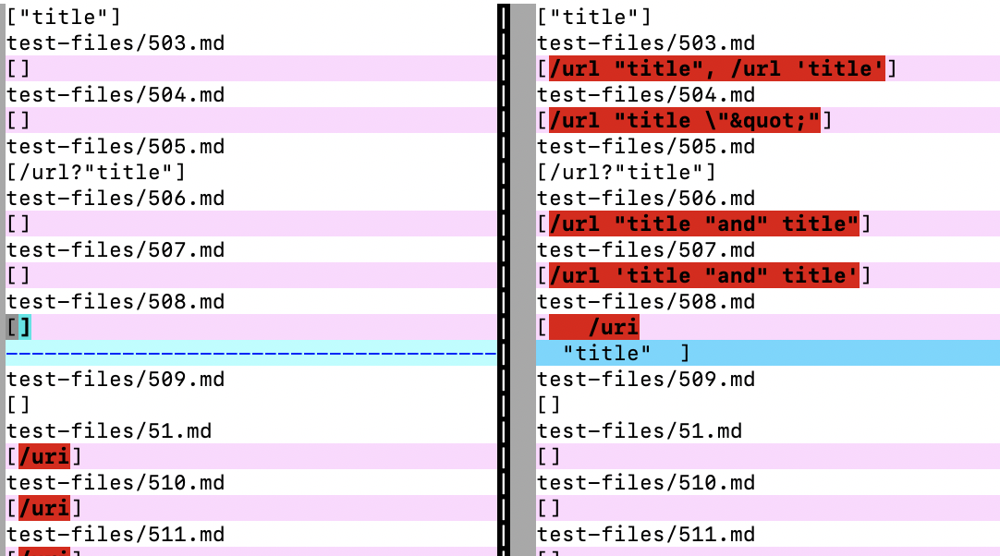
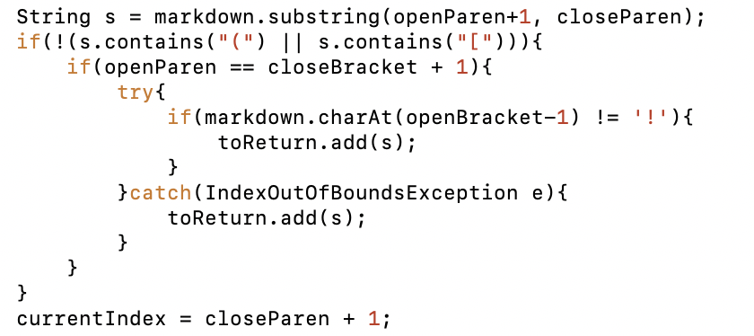
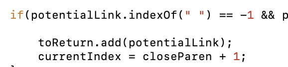

# Week 10 Lab Report (June 5th, 2022)
## Overview
> This report is going to review the difference between the given Markdown-parser and the one I wrote, then describe the bugs causing the difference. 

**Compoents**
1) Differences

    * Difference #1
    * Difference #2

## Differences

These differences were found using the `vimdiff` method as shown in the image. It compares the two documents side by side and highlights said differences. 

**Difference #1 ([test-files/503.md](https://github.com/nidhidhamnani/markdown-parser/blob/main/test-files/503.md))**

Actual Output (Given Parser): []

Actual Output (My Parser): [/url "title", /url 'title']

Expected Output: ["title"]

Both are incorrect!

 
The expected output is obtained from viewing the preview of the file on Github. 

For my implementation, the output was unable to obtain the correct link because of the inference of the quotation marks. The quotation mark is messing with the String in java. 

In this portion, adding a precaution to check for quotation mark could help avoid the problem. 

**Difference #2 ([test-files/51.md](https://github.com/nidhidhamnani/markdown-parser/blob/main/test-files/51.md))**

Actual Output (Given Parser): [/uri]

Actual Output (My Parser): []

Expected Output: []

The Given Parser is incorrect!

 
The expected output is obtained from viewing the preview of the file on Github. 

For the given parser's implementation, it is somehow reading a line break as a url and recording that even though there is no content there. Perhaps the dash mark is being misused in the program. 

In this portion, before adding the link, check if there is actually content in the url would help with the bug. 